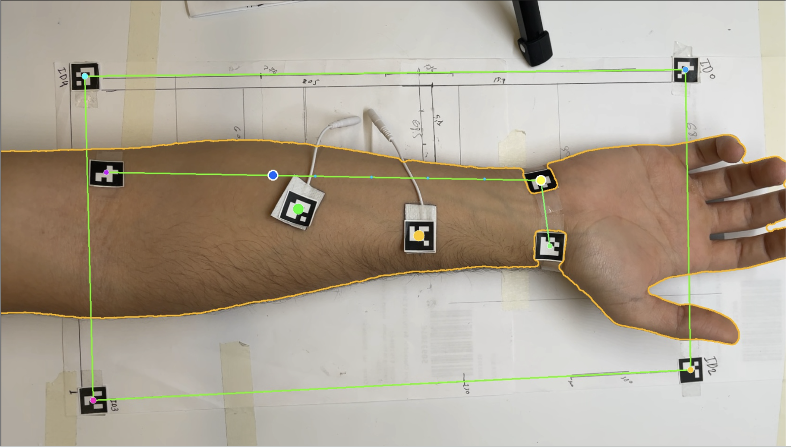
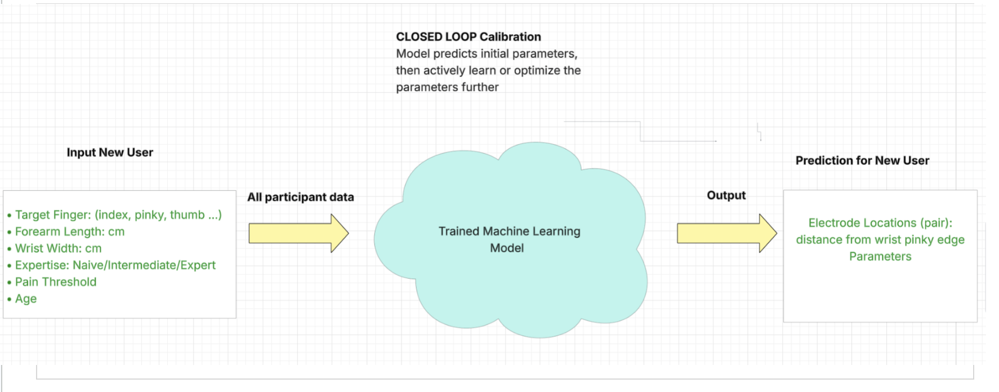
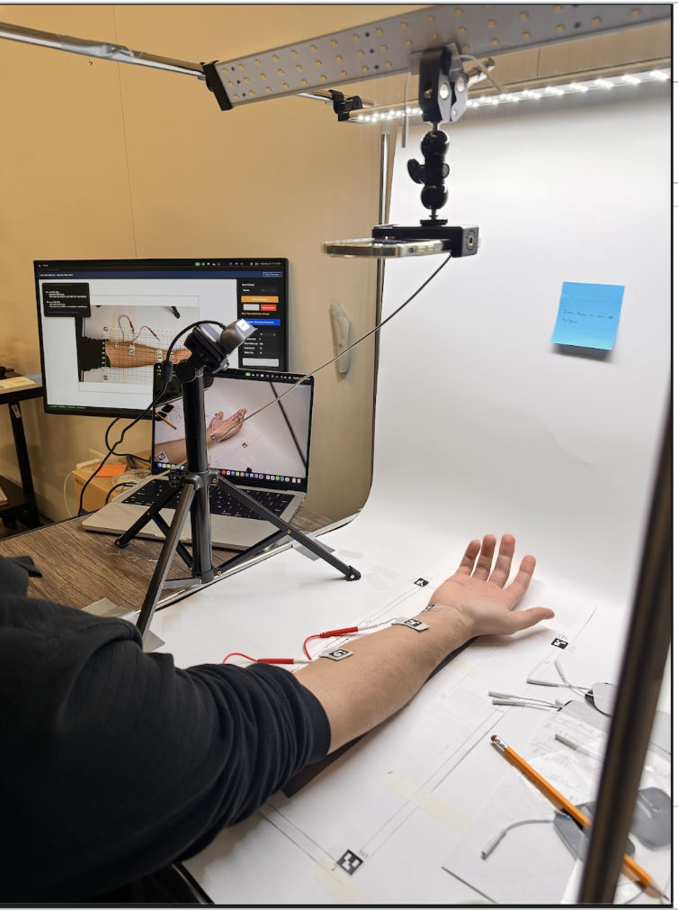
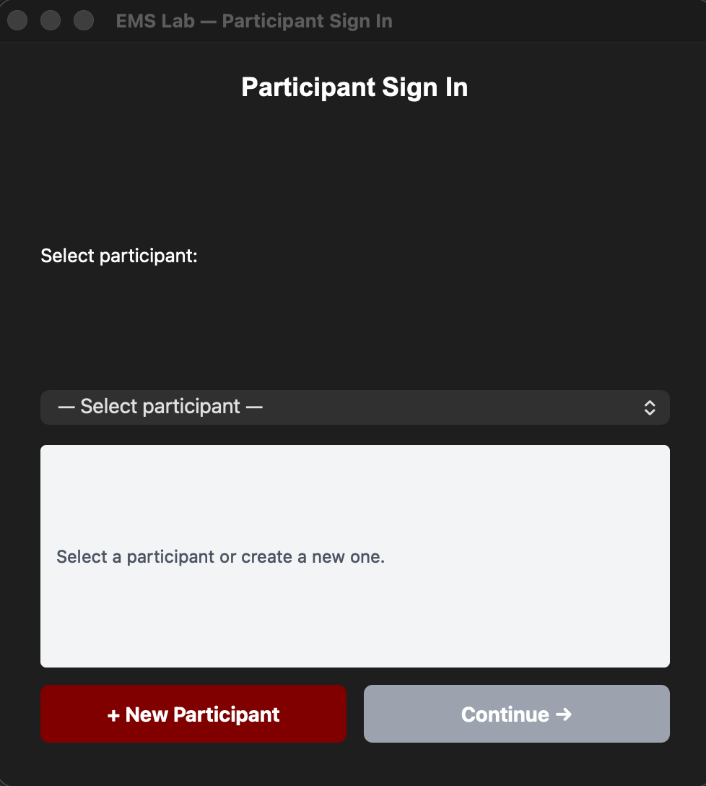
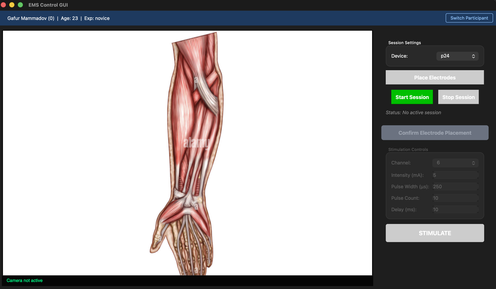
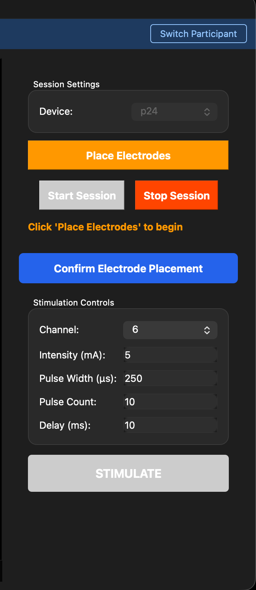
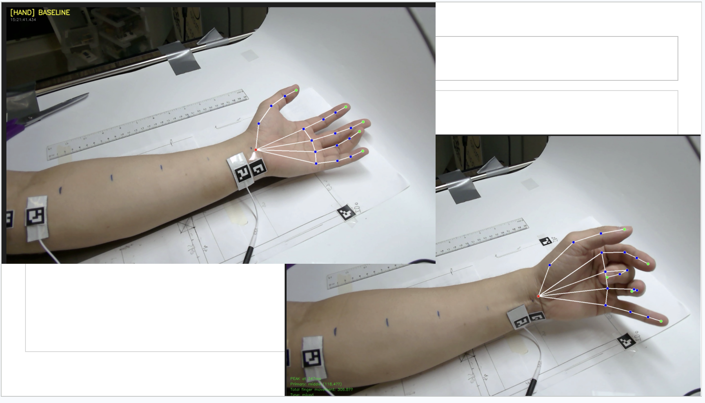

# EMS Control GUI

**A research instrument for characterizing electrical muscle stimulation.** It fires a
stimulation into the forearm, measures the resulting hand and wrist movement with computer
vision, and records electrode geometry, stimulation parameters, and outcome to a database —
producing a labeled dataset that maps *where you stimulate and how* to *what the hand does*.

Built with PyQt6, OpenCV, MediaPipe, and SQLite.

<p align="center">
  
  <br>
  <em>Live tracking — mat corners establish the homography (green), the wrist and elbow markers
  define the forearm axis, and electrode positions are resolved into anatomical coordinates.</em>
</p>

---

## Contents

- [Motivation](#motivation)
- [What it captures](#what-it-captures)
- [Hardware](#hardware)
- [Installation](#installation)
- [Running a session](#running-a-session)
- [Architecture](#architecture)
- [Design decisions](#design-decisions)
- [Data model](#data-model)
- [Project layout](#project-layout)
- [Further documentation](#further-documentation)

---

## Motivation

Electrical muscle stimulation can produce specific hand movements — flex a finger, extend the
wrist — by delivering current through surface electrodes on the forearm. The inverse problem is
the interesting one: given a movement you *want*, where should the electrodes go and at what
intensity?

That mapping is poorly characterized, and it resists simple description. It depends on
individual anatomy, skin impedance, and electrode placement at millimeter resolution. Building
a model of it requires a large number of trials with placement recorded precisely enough to be
comparable *between people whose forearms are different sizes* — which manual measurement,
a ruler and a spreadsheet, cannot deliver at the necessary precision or volume.

<p align="center">
  
  <br>
  <em>The downstream goal: a model that takes a new participant's anatomy and a target finger,
  and predicts where to place the electrodes and at what parameters — refined by closed-loop
  calibration. This application produces the training data.</em>
</p>

Each keypress produces one fully labeled example, and a session produces hundreds.

## What it captures

| Dimension | Recorded |
|---|---|
| **Participant** | ID, age, arm width and length, skin resistance at 100 Hz / 1 kHz / 10 kHz / 100 kHz, experience level, pain threshold |
| **Electrode geometry** | Position in pixels, in mat millimeters, and in normalized anatomical coordinates — captured fresh at every stimulation, so placement drift is tracked rather than assumed away |
| **Stimulation** | Channel, intensity (mA), pulse width (μs), pulse count, inter-pulse delay |
| **Outcome** | Wrist angle delta (signed, flexion/extension), per-finger flexion change across three joints each, peak latency, movement classification |
| **Context** | Session audio, transcribed locally with Whisper and then discarded |

`db.export_csv()` flattens the entire schema into one row per stimulation — roughly 80
columns, no joins required — ready for pandas or scikit-learn.

---

## Hardware

**Stimulator** — P24, 8 channels, 0–100 mA, pulse width to 500 μs, connected over USB serial
and located by autodetect at session start.

**Three cameras**

| Camera | Index | Role |
|---|---|---|
| Forearm (top-down, on the mat) | 0 | ArUco detection — mat calibration, arm axis, electrode positions |
| Hand (zoomed on fingers) | 1 | MediaPipe Hand Landmarker — per-finger joint angles |
| Pose (laptop webcam) | 2 | MediaPipe Pose Landmarker — wrist angle |

**Printed ArUco mat** — 199 × 380 mm, 16 mm markers.

| Marker ID | Purpose |
|---|---|
| 0, 2, 3, 4 | Mat corners, clockwise from top-left |
| 1 | Wrist |
| 7 | Elbow |
| 5, 6 | Electrode pads |

<p align="center">
  
  <br>
  <em>The capture rig — overhead camera on the marker mat, diffuse lighting to suppress glare
  on the ArUco markers, and the operator display showing live tracking.</em>
</p>

---

## Installation

```bash
git clone https://github.com/gafur55/ems-app-dev.git
cd ems-app-dev

python3 -m venv .venv
source .venv/bin/activate          # Windows: .venv\Scripts\activate

pip install -r requirements.txt
```

**macOS system dependencies** — PortAudio for PyAudio, ffmpeg for Whisper:

```bash
brew install portaudio ffmpeg
```

**The EMS device library is a separate install.** `core/ems_controller.py` wraps an
external open-source EMS toolkit which is deliberately not vendored into this repository.
Install it into the same environment:

```bash
pip install git+<UPSTREAM_TOOLKIT_URL>
```

The controller degrades gracefully if the library is absent — it logs a warning and returns
`False` from every call — so the interface and vision pipeline remain testable without a
stimulator attached. Note that this means a missing library produces a *working UI that never
stimulates*, so confirm the connection status in the header before assuming a null result is
physiological.

**Camera calibration**, one time per camera per machine:

```bash
python3 calibrate_cameras.py --camera 0
python3 calibrate_cameras.py --camera 1
python3 calibrate_cameras.py --camera 2
```

This writes intrinsics to `calibration/camera_{index}.npz`. Missing files are non-fatal — the
app warns and proceeds on raw frames, at some cost to measurement accuracy near the frame edges.

---

## Running a session

```bash
python3 main.py
```

**1. Sign in.** Select an existing participant or create one. The dialog surfaces stored arm
dimensions, skin resistance, and pain threshold so the operator can calibrate expectations
before the first pulse.

<p align="center">
  
</p>

**2. Start the session.** This creates the session row, connects the stimulator, spins up three
camera threads, opens the tracking preview windows, and begins audio capture.

<p align="center">
  
  <br>
  <em>The main window — participant context in the header, live view on the left, session and
  stimulation controls on the right.</em>
</p>

**3. Place the electrodes**, then press **P**. The system validates that all four mat corners,
the wrist marker, and both electrode markers are visible; if any are missing it names them
explicitly rather than failing generically. On success it builds the anatomical coordinate
mapper and enables stimulation.

**4. Set parameters and press Space.** Baselines are captured, the pulse train fires, movement
is measured, and everything is written to the database.

<p align="center">
  
</p>

**5. Repeat**, adjusting placement and parameters. Each stimulation is logged independently
with its own electrode snapshot.

**6. Stop the session.** Closes the audio file, transcribes it in the background, stops
cameras, disconnects the device, and updates the participant's recorded pain threshold if this
session exceeded it.

### Parameters

| Field | Default | Range |
|---|---|---|
| Channel | 6 | 0–7 |
| Intensity | 5 mA | 0–100 mA |
| Pulse width | 250 μs | 0–500 μs |
| Pulse count | 10 | 1–1000 |
| Delay | 10 ms | 0–10,000 ms |

### Hotkeys

| Key | Action |
|---|---|
| `Space` | Trigger stimulation |
| `P` | Place electrodes / calibrate |
| `I` / `U` | Intensity ±1 mA |
| `W` / `Q` | Pulse width ±10 μs |
| `C` / `X` | Pulse count ±5 |
| `R` | Reset parameters to defaults |

Hotkeys are suppressed while a text field holds focus, so typing a value cannot fire a pulse.

---

## Architecture

Four layers, each depending only on the one below it.

```
┌──────────────────────────────────────────────────────────────┐
│  UI  (PyQt6)                                                 │
│  EMSWindow · BodyDiagramView · SceneManager                  │
│  ElectrodeManager · CalibrationManager · panels · previews   │
└──────────────────────────────────────────────────────────────┘
                              ↕
┌──────────────────────────────────────────────────────────────┐
│  CORE                                                        │
│  EMSController      device I/O over USB serial               │
│  ForearmCamera      ArUco pipeline orchestration             │
│  PoseTracker        wrist angle, MediaPipe Pose              │
│  HandTracker        finger joint angles, MediaPipe Hands     │
│  SessionRecorder    audio → WAV                              │
│  SessionTranscriber WAV → text, Whisper, local               │
└──────────────────────────────────────────────────────────────┘
                              ↕
┌──────────────────────────────────────────────────────────────┐
│  DATA   EMSDatabase (SQLite) · models · flat export          │
└──────────────────────────────────────────────────────────────┘
                              ↕
┌──────────────────────────────────────────────────────────────┐
│  CONFIG   mat geometry · marker IDs · parameter defaults     │
└──────────────────────────────────────────────────────────────┘
```

### The vision pipeline

Electrode localization runs as three sequential stages on each frame of the forearm camera.
Each stage consumes the previous stage's output, and each can fail independently.

```
        camera frame
             │
             ▼
   ┌──────────────────────┐
   │ 1. MatCalibrator     │  Detects mat corner markers 0, 2, 3, 4.
   │                      │  Solves the homography H mapping pixels → mat mm.
   └──────────────────────┘  Emits: H, px_per_mm
             │
             ▼
   ┌──────────────────────┐
   │ 2. ArmTracker        │  Detects wrist (ID 1) and elbow (ID 7).
   │                      │  Defines the forearm axis; scales s=1 using the
   └──────────────────────┘  participant's stored arm length.
             │
             ▼
   ┌──────────────────────┐
   │ 3. ElectrodeTracker  │  Detects electrode markers 5 and 6.
   │                      │  Projects them into anatomical (s, t).
   └──────────────────────┘
             │
             ▼
   annotated frame + state dict → UI
```

If a stage can't lock on — a mat corner occluded by the participant's own arm is the common
case — downstream stages skip and the UI reports precisely which marker is missing. The
pipeline never emits a partially-valid coordinate.

### Coordinate systems

Three spaces coexist, and every electrode placement is stored in all three.

| Space | Units | Origin | Purpose |
|---|---|---|---|
| **Pixel** | integer px | frame top-left | drawing to screen |
| **Mat** | mm | mat corner ID 0 | camera-angle-independent physical measurement |
| **Anatomical** | dimensionless `(s, t)` | participant's wrist | cross-participant generalization |

In anatomical space, `s` runs longitudinally — `0` at the wrist, `1` at the elbow — and `t`
runs perpendicular to the forearm axis, normalized by forearm width, positive toward the thumb
and negative toward the pinky.

### Concurrency

The measured event lasts under two seconds, and three things must happen inside it.

```
T+0ms      Pose and hand baselines captured
           (mean of the last 5 samples from each tracker)

T+30ms     Stimulation row written → stim_id
           Forearm frame captured to disk
           Electrode positions snapshotted from live ArUco state

T+50ms     ┌─ thread A ──────────┐  ┌─ thread B ──────────┐  ┌─ main ─────────┐
           │ wrist angle @ 50Hz  │  │ finger angles @50Hz │  │ pulse train    │
           │ for 1.6s            │  │ for 1.6s            │  │ fires          │
           └─────────────────────┘  └─────────────────────┘  └────────────────┘

T+1.65s    Threads join; results merged into one movement record
           1 row → movement_results, 15 rows → joint_angles

T+1.7s     Ready for the next stimulation
```

Baselines are taken immediately before firing rather than at session start, so every
measurement is a delta against the hand's actual resting state at that moment — which drifts
over a session as the participant shifts position.

<p align="center">
  
  <br>
  <em>Hand tracking at baseline (left) and at peak response (right). The overlay reports peak
  latency, the primary finger, and total flexion change for the stimulation.</em>
</p>

---

## Design decisions

**Homography per frame instead of a fixed camera rig.** Recomputing the perspective transform
from the four mat corners on every frame means the camera needs no particular mounting
geometry — tilt is corrected automatically, and the on-screen 10 mm measurement grid tracks
the physical mat even at an oblique angle. The cost is a dependency on all four corners
staying visible; the benefit is that the rig can be packed up and re-set between sessions
without recalibration.

**Anatomical normalization is what makes the dataset useful.** Recording electrode position in
millimeters from the wrist seems obviously right and is quietly wrong: 40 mm along a 24 cm
forearm and 40 mm along a 30 cm forearm sit over different muscles. Normalizing to `(s, t)`
means the same coordinate describes approximately the same anatomy across participants, which
is the property that lets a model trained on one group predict for someone new. Millimeter and
pixel positions are retained too, since normalization is lossy and the raw geometry may matter
for questions not yet asked.

**Peak detection by thresholded averaging.** The single frame of maximum displacement is the
noisiest possible estimator — it selects for landmark jitter as much as for movement. Instead
the trackers locate the peak, then average every frame within 80% of it. The result is stable
and reproducible across repeated identical stimulations.

**Signed wrist angle from a geometric construction.** Rather than take a raw joint angle, the
wrist measurement builds two vectors — elbow→wrist and wrist→hand-center, where hand center is
the midpoint of the index and pinky landmarks — takes the deviation from straight, and derives
the sign from their 2D cross product. Positive is extension, negative is flexion, with the
frame mirroring accounted for. This yields a single signed scalar that behaves correctly
through zero, instead of an unsigned magnitude plus a separate direction flag.

**Crash-safe audio, then deletion.** Audio is written to disk in 4096-sample chunks roughly
every 93 ms rather than accumulated in memory, so an unexpected termination costs at most one
chunk. Once Whisper has transcribed the file locally, the WAV is deleted — the research value
is in the text, and retaining raw voice recordings of participants is a liability with no
corresponding benefit.

**Graceful degradation over hard failure.** Missing camera calibration warns and continues.
A missing EMS library warns and continues. An occluded marker disables the dependent action
and says which marker. The system is used by researchers mid-session with a participant
waiting; a crash costs a session, while a clear warning costs a few seconds.

---

## Data model

One SQLite file, eight tables.

```
participants
     │ 1:N
     ▼
  sessions
     │
     ├──1:N──▶ stimulations ──1:1──▶ movement_results ──1:N──▶ joint_angles
     │               ▲
     │               │ electrodes reference the stimulation they
     ├──1:N──▶ electrodes    were captured at, preserving drift
     │
     └──1:N──▶ session_recordings ──1:1──▶ session_transcriptions
```

| Table | Rows per session | Contents |
|---|---|---|
| `participants` | 1 per person, global | demographics, arm geometry, impedance, threshold |
| `sessions` | 1 | device, target gesture, calibration factor, timestamps |
| `stimulations` | N | channel, intensity, pulse width, count, delay |
| `electrodes` | 2 per stimulation | pixel, mat-mm, and anatomical position |
| `movement_results` | 1 per stimulation | wrist delta, primary finger, peak latency |
| `joint_angles` | 15 per stimulation | 5 fingers × 3 joints, baseline / peak / delta |
| `session_recordings` | 1 | path, duration, status |
| `session_transcriptions` | 1 | text, language, model |

Electrode position is stored per *stimulation*, not per session. Pads shift over a long
session, and treating placement as a session-level constant would silently corrupt the labels.

---

## Project layout

```
ems-app-dev/
├── main.py                       entry point; applies the macOS Qt plugin fix
├── requirements.txt
│
├── config/
│   └── settings.py               mat geometry, marker IDs, parameter defaults
│
├── core/
│   ├── ems_controller.py         stimulator wrapper over the external toolkit
│   ├── session_recorder.py       chunked WAV capture
│   ├── session_transcriber.py    local Whisper transcription
│   └── vision/
│       ├── mat_calibrator.py     stage 1 — homography from mat corners
│       ├── arm_tracker.py        stage 2 — wrist, elbow, forearm axis
│       ├── electrode_tracker.py  stage 3 — electrodes in (s, t)
│       ├── forearm_camera.py     threaded orchestration of stages 1–3
│       ├── anatomical_mapper.py  pixel ↔ (s, t) conversion
│       ├── pose_tracker.py       wrist angle
│       ├── hand_tracker.py       finger joint angles
│       └── undistorter.py        lens intrinsics, precomputed remap
│
├── data/
│   ├── database.py               schema, CRUD, flat export
│   ├── models.py                 Session, Electrode, StimulationEvent
│   └── get_db_to_csv.py
│
└── ui/
    ├── main_window.py            EMSWindow — session lifecycle coordinator
    ├── graphics_view.py          BodyDiagramView — live feed and overlays
    ├── managers/                 scene, electrode, calibration
    └── widgets/                  sign-in, parameter, stimulation, previews
```

---

## Further documentation

- **[`EMS_System_Documentation.md`](EMS_System_Documentation.md)** — full system reference:
  millisecond-level stimulation timeline, component-by-component walkthrough, complete schema,
  coordinate derivations, operational tips.
- **[`ArUco_Electrode_Capture_Deep_Dive.md`](ArUco_Electrode_Capture_Deep_Dive.md)** — the
  marker detection and electrode capture pipeline in detail.

## Built with

PyQt6 · OpenCV · MediaPipe · NumPy · SQLite · PyAudio · OpenAI Whisper · pyserial
